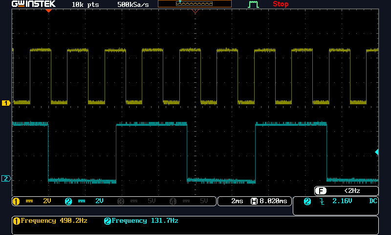
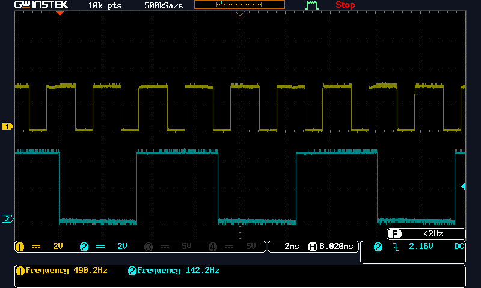

# fanRPM
A Controller for a Four Wire Brushless DC Fan
Control a fan with a potentiometer wiper into A0
Reports fan RPM by the method of measuring the period of the fan tachometer and computing a period.  This method becomes course at high RPM.

**Note: the Tag for Version 0.6 is a change to only print RPM. Used for fan obstruction testing with the Arduino Serial Ploter.**

The fan under test was a GDSTIME model 1238 120mm 12V PWM Fan, 120mm x 38mm 213CFM DC Brushless Cooling Fan
The signals on the four wires are:
> Connector: 4-PIN; Lead wire: UL Type (+): Red Wire ; (-): Black Wire. FG function：Yellow Wire. PWM: Blue Wire. 

Circuit Description:
Arduino UNO.
A 10K pot with wiper to A0,
A 300 OHm resistor from D9 out to the PWM in on the fan.
A 10K pull up on the FG (Frequency Generator) pin of the fan.  The FG to D2 pin for measuring fan speed.

Screen capture of PWM and FG signals.

## Notes on Fan Test
With in the fan, the PWM equivilant circuit is a 5K resistor pull up to 5V Vcc.
The PWM short curcuit current was 1mA

The FG (Frequency Generator) required a pull up resistor to Vcc. I used a 10K and got good waveform.

Limits of testing: 
My fan speed was limited by the 1Ammp current limit of my 12V supply.  I got maxium fan speed with he A0 adjusted to about the mid point.

Program serial monitor output when adjusting for maximum fan RPM.

## 3.3 Volt Compatibility Testing
Experiment with a solution for buffering the GPIO pin through an NPN inverting switch into the PWM.
Used PN2222 with emitter ground. Use 10K resistor from D9 into the base. Collector to the PWM through 300 Ohms.
This inverts the sense of the PWM so the code should be changed to invert the sense of the speed control.  

Screen capture of PWM Inverter and FG signals.
  
Note how the logic high voltage of this PWM is about 3V.

